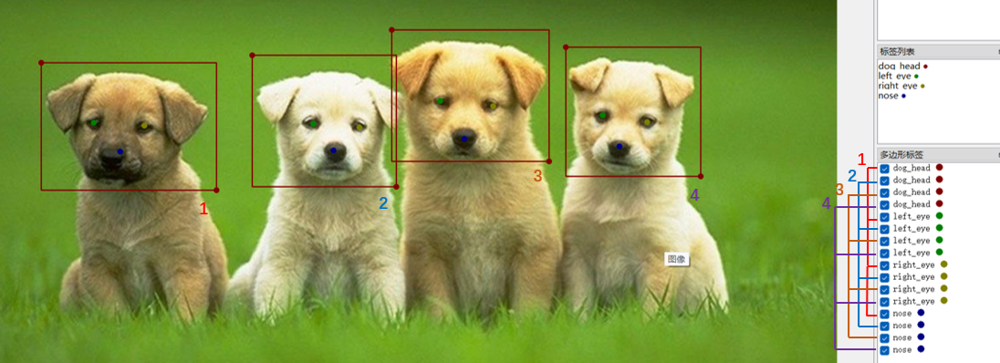
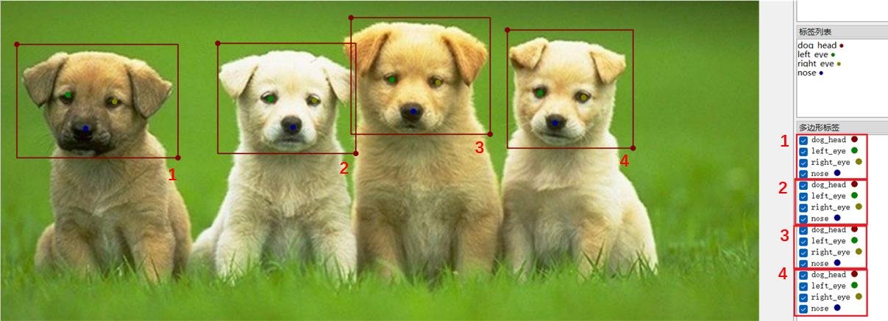

# labelme_convert
## 概述
本项目旨在提供一种将采用labelme标注的数据集转成coco或yolo格式的数据集的工具，以便于训练对应的模型。目前仅支持同类单/多实例的关键点检测任务，不支持不同类实例的姿态估计
## 如何使用
### 1. 将该项目克隆到本地：
```
git clone https://github.com/seirok/labelme_convert.git
```
### 2. 修改配置文件
根据你的数据集修改项目文件夹下的配置文件`config.yaml`,其中：  
`class_name`: 识别对象的名称  

`input`: labelme格式下的数据集  

`output`：所需要创建的coco/yolo格式数据集的根目录  

`joint_num`: 对象关键点数目  

`ratio`：验证集：训练集数据量比例，默认为0.2  

`convert_type`: 转化类型。如果是labelme转coco，请填`labelme2coco`；如果是labelme转yolo，请填`labelme2yolo`。  

`label_style`: 标注风格。如果你是按照“先画一个矩形框，再在其中依次标注关键点”的方式进行标注的话，填入`single`
如果是“先依次画好矩形框，再依次按顺序标注关键点”的方式，填入`group`  

以小狗头部姿态数据为例,group 对应的连续标注方式如下图所示：  
  

single对应的实例标注方式：  
  

`key_points`: 对象关键点列表。将关键点名称按列表填入  

`pic_format`:数据集中图片后缀格式，默认为`png`格式  

同样以小狗头部姿态数据为例，对应的yaml文件：
 ```
 class_name: dog_head
input: your labelme-format data directory
output: your coco/yolo project directory
joint_num: 3
ratio: 0.2
convert_type: labelme2coco
label_style: group
keypoints: ['nose', 'left_eye','right_eye']
pic_format: png
 ```

### 3. 运行
`python labelme_convert.py`


